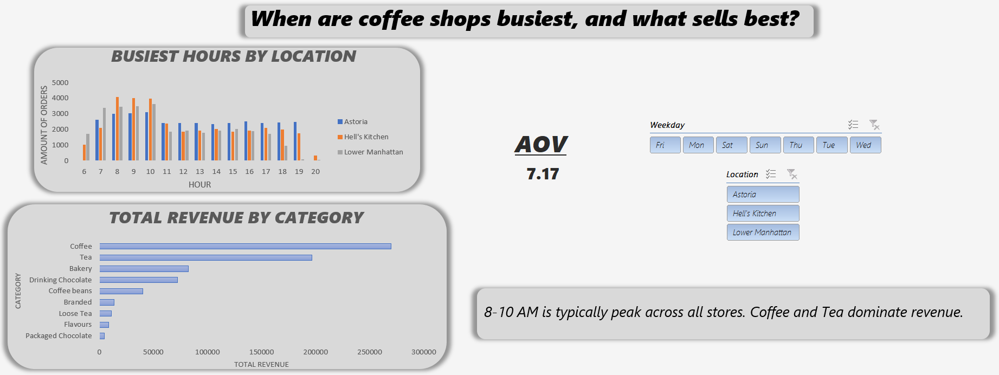

# Coffee Shop Analytics

**Dataset:** *Coffee Shop Sales (Maven Roasters)*  

Analyze sales trends, busiest hours, and revenue drivers for a fictitious coffee shop chain.

---

## Key Findings

- **Peak Hours:** Morning rush (8–10am) is highest across locations; weekdays outperform weekends.  
- **Revenue Drivers:** Coffee & tea are top sellers. Average Order Value (AOV) is highest at *Lower Manhattan*.

---

## Live Power BI Report

Explore sales, top products, and store trends in the interactive dashboard:  

👉 [View Interactive Power BI Report](https://app.powerbi.com/groups/me/reports/b7c807e9-af31-4223-80ae-7e0f362b70ef/366d73b568949376e400?experience=power-bi)

---

## Project Files

- [📊 Excel Dashboard](excel/Coffee-Shop-Sales-Analysis-2.xlsx)  
- [📈 Power BI File (.pbix)](powerbi/coffee_shop_sales_analysis.pbix)  
- [🗄️ SQL Schema](sql/coffee_shop_sales.sql)  
- [🔎 Analysis Queries](sql/coffee_shop_sales_analysis.sql)  
- [🐍 Python/MySQL Connector](python/csv_loading.py)  
- [📄 README](README.md)
